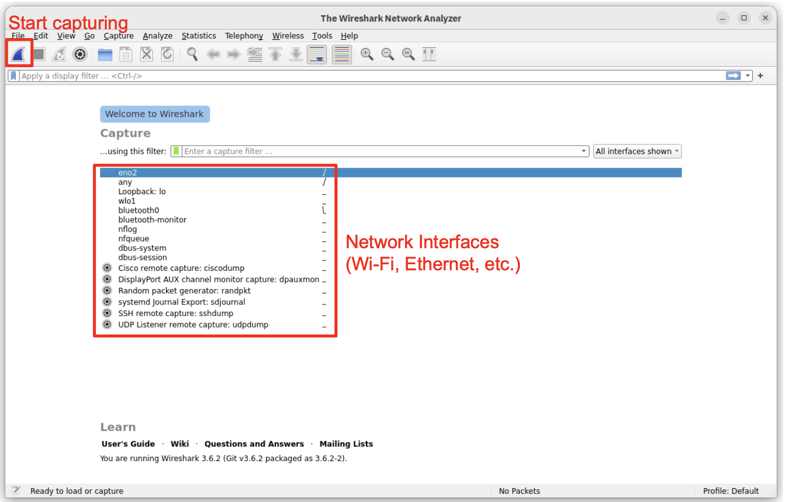
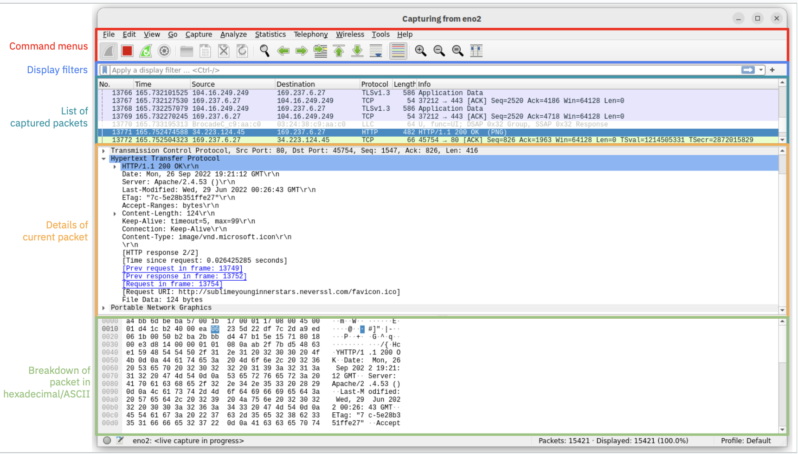

# Week 1: Wireshark + dpkt
## [Slides](https://docs.google.com/presentation/d/1bsi8iAYgtfdLyAiSvb6PLUnxZmy7MN6CeaqHT1ccdJU/edit?usp=sharing)

## Tutorial
### Wireshark ([installation](https://www.wireshark.org/download.html), [documentation](https://www.wireshark.org/docs/wsug_html_chunked/))

Wireshark is an advanced packet capturer and analyzer that allows you to inspect the packets sent to/from your machine.


<p align="center">Wireshark initial screen</p>

#### Capturing packets
1. Open Wireshark and choose a network adapter to capture packets from (e.g., Wi-Fi, ethernet, etc.).
2. Start capturing packets by cliking the icon on the top-left.
3. In your browser, visit [httpforever.com](httpforever.com), a HTTP-only website.
4. In Wireshark, stop capturing packets by clicking the stop icon.


<p align="center">Wireshark capture screen</p>

#### Filtering packets
In the display filter field, experiment the following filters.
 - `http`: will show all http packets sent and received
 - `frame contains "some query"`: will show packets containing the string "some query"
 - `tcp.port==80`: will show all packets sent/received on port 80
 - `ip.src==ip_address`: will show all packets whose source IP is `ip_address` (replace `ip_address` with any IP)
 - `ip.dst==ip_address`: will show all packets whose destination IP is `ip_address` (replace `ip_address` with any IP)
 - `tcp.port==80 && ip.src==ip_address`: will AND both operators
 - `tcp.port==80 || ip.src==ip_address`: will OR both operators
 - `!ip.src==ip_address`: will NOT the filter

Read the documentation for more sophisticated filters.

#### Saving captures
Go to `File > Save As` and set the format as `Wireshark/tcpdump/... - pcap` to save the file in `.pcap` format. Use this saved file for the following dpkt tutorial.

### dpkt ([installation](https://pypi.org/project/dpkt/), [simple documentation](https://kbandla.github.io/dpkt/), [advanced documentation](https://dpkt.readthedocs.io/en/latest/))
dpkt is a Python library that allows you to parse and iterate over packet-capture (`.pcap`) files with definitions for the basic TCP/IP protocols.

#### Sample code

Sample code to get you familiar with the dpkt syntax can be found [here](https://github.com/klvijeth/ecs152a-fall-2024/blob/main/week1/code/dpkt-example.py). The code iterates over a packet capture and prints out the request and response headers from HTTP requests. You can run it using the following syntax where `path_to_pcap_file` is the path to a packet capture.

```python dpkt-example.py path_to_pcap_file```

For more details such as how to parse IP and MAC addresses, please refer to the dpkt documentation.

## ICMP
Internet Control Message Protocol (ICMP) is a network layer protocol that's generally used for diagnosing network issues. Two widely-used tools that use ICMP are `ping` and `traceroute`.

### Ping
The `ping` command tests whether a target host is online and estimates the round-trip times (RTTs), i.e., the time it takes to send and receive data from that host.

#### Syntax
 - `ping ip_address`
 - `ping domain`

### Traceroute
The `traceroute` command calculates the round-trip times (RTTs) to each individual hop (i.e., routers) along the route to a target host.

#### Syntax
 - `traceroute ip_address`
 - `traceroute domain`

